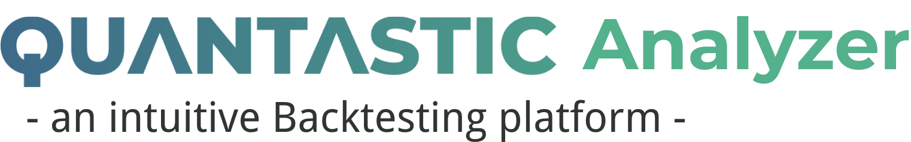

 

# Description
- Backtesting Web Application platform
- Project for Capstone Design I (CSE4186)

# Files
- `quantastic_webapp`
  > contains all files used in Front End Development (written in HTML, CSS, JavaScript)
- `quantastic_docs`
  > contains all documentation - development process, contribution and other remarks, final presentation PPT
- `quantastic_assets`
  > contains details on UI assets - Conponents List, Wireframe, Prototype, etc.

 

# UI Assets

 

# Project Structure

 

# Sample Output

 

# University Wiki Entry
http://cscp2.sogang.ac.kr/CSE4186/index.php/Quantastic
